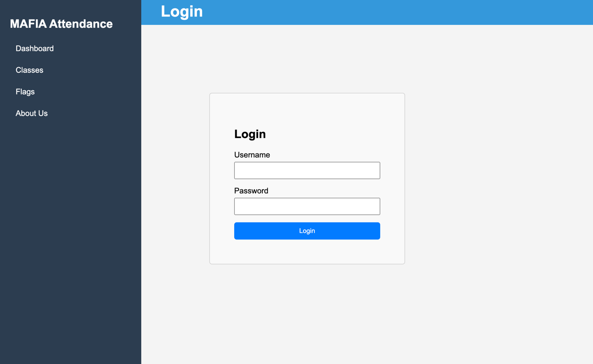

# Capstone Team 5: IoT-based Authentication for Automated Classroom Attendance

## Running in Development Environment 

### Backend Service
The REST backend service is built using Node.js and Express.js with Typescript. 
Use the following script below to install dependencies and start up the server.

Add the `.env` containing S3 access keys and variables to the root of the `server/` directory.
```
.
└── Capstone/
    └── Server/
        └── .env
```

Run the following to boot up the backend service
```bash
cd server
npm install
npm run init-data
npm start
```

Output: 
```
> server@1.0.0 start
> NODE_OPTIONS='--loader ts-node/esm' ts-node index.ts

(node:32961) ExperimentalWarning: `--experimental-loader` may be removed in the future; instead use `register()`:
--import 'data:text/javascript,import { register } from "node:module"; import { pathToFileURL } from "node:url"; register("ts-node/esm", pathToFileURL("./"));'
(Use `node --trace-warnings ...` to show where the warning was created)
(node:32961) [DEP0180] DeprecationWarning: fs.Stats constructor is deprecated.
(Use `node --trace-deprecation ...` to show where the warning was created)
Server is running on port 3000
S3 Bucket Name: team-5-capstone-25
```

### Frontend Service
The web client is built on Angular with Typescript.
In a second terminal window, use the following script to install dependencies and startup the web client

```bash
cd client
npm install
npm start
```

Output:
```
> client@0.0.0 start
> ng serve

Component HMR has been enabled.
If you encounter application reload issues, you can manually reload the page to bypass HMR and/or disable this feature with the `--no-hmr` command line option.
Please consider reporting any issues you encounter here: https://github.com/angular/angular-cli/issues

Initial chunk files | Names         |  Raw size
main.js             | main          | 190.65 kB | 
polyfills.js        | polyfills     |  90.20 kB | 
styles.css          | styles        |   7.84 kB | 

                    | Initial total | 288.69 kB

Application bundle generation complete. [2.365 seconds]

Watch mode enabled. Watching for file changes...
NOTE: Raw file sizes do not reflect development server per-request transformations.
9:45:42 PM [vite] (ssr) Re-optimizing dependencies because lockfile has changed
9:45:42 PM [vite] (client) Re-optimizing dependencies because lockfile has changed (x2)
  ➜  Local:   http://localhost:4200/
  ➜  press h + enter to show help
```

Navigate to http://localhost:4200/ to interact with the Web Client from a browser


#### Logging In
Use the following default credentials to access the Web Client:
- username: prof2
- password: password123

## Running in Production (Physical Controller and Sensors Required)
To perform a release, run the following script to build the project and create a release zip.
```bash
./release.sh
```

This will create a `release/release.zip` file in the root of the project directory. You can test this by cd-ing into the `release/` directory and running the following command. ( To run the docker-compose, you need to have docker installed on your machine. )
```bash
cd release
docker-compose up --build -d
```

This will start up the docker container and run the server on port 3000, the client on port 8080, and the controller on port 5000.